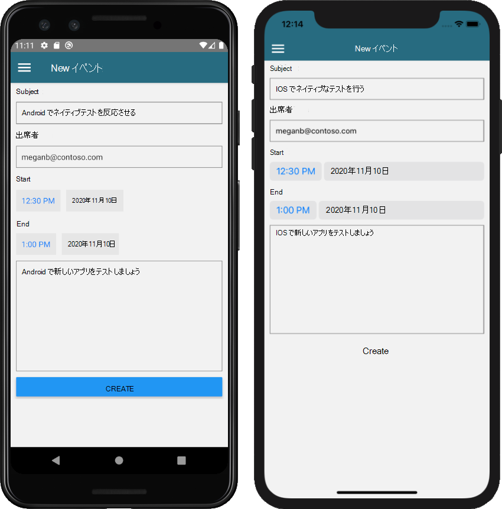

<!-- markdownlint-disable MD002 MD041 -->

<span data-ttu-id="3d660-101">このセクションでは、ユーザーの予定表にイベントを作成する機能を追加します。</span><span class="sxs-lookup"><span data-stu-id="3d660-101">In this section you will add the ability to create events on the user's calendar.</span></span>

## <a name="create-the-new-event-screen"></a><span data-ttu-id="3d660-102">新しいイベント画面を作成する</span><span class="sxs-lookup"><span data-stu-id="3d660-102">Create the new event screen</span></span>

1. <span data-ttu-id="3d660-103">を開き、次の関数をクラスに追加し **ます。** `GraphManager`</span><span class="sxs-lookup"><span data-stu-id="3d660-103">Open **./graph/GraphManager.ts** and add the following function to the `GraphManager` class.</span></span>

    :::code language="typescript" source="../demo/GraphTutorial/graph/GraphManager.ts" id="CreateEventSnippet":::

    <span data-ttu-id="3d660-104">この関数は、Graph SDK を使用して新しいイベントを作成します。</span><span class="sxs-lookup"><span data-stu-id="3d660-104">This function uses the Graph SDK to create a new event.</span></span>

1. <span data-ttu-id="3d660-105">**NewEventScreen** という名前の **スクリーン** に新しいファイルを作成し、次のコードを追加します。</span><span class="sxs-lookup"><span data-stu-id="3d660-105">Create a new file in the **./screens** named **NewEventScreen.tsx** and add the following code.</span></span>

    :::code language="typescript" source="../demo/GraphTutorial/screens/NewEventScreen.tsx" id="NewEventScreenSnippet":::

    <span data-ttu-id="3d660-106">関数の動作を検討 `createEvent` します。</span><span class="sxs-lookup"><span data-stu-id="3d660-106">Consider what the `createEvent` function does.</span></span> <span data-ttu-id="3d660-107">`MicrosoftGraph.Event`フォームからの値を使用してオブジェクトを作成し、そのオブジェクトを関数に渡し `GraphManager.createEvent` ます。</span><span class="sxs-lookup"><span data-stu-id="3d660-107">It creates a `MicrosoftGraph.Event` object using the values from the form, then passes that object to the `GraphManager.createEvent` function.</span></span>

1. <span data-ttu-id="3d660-108">**/Menus/DrawerMenu.tsx** を開き、次の `import` ステートメントをファイルの先頭に追加します。</span><span class="sxs-lookup"><span data-stu-id="3d660-108">Open **./menus/DrawerMenu.tsx** and add the following `import` statement at the top of the file.</span></span>

    ```typescript
    import NewEventScreen from '../screens/NewEventScreen';
    ```

1. <span data-ttu-id="3d660-109">次のコードを、要素内の `<Drawer.Navigator>` 行のすぐ上に追加し `</Drawer.Navigator>` ます。</span><span class="sxs-lookup"><span data-stu-id="3d660-109">Add the following code inside the `<Drawer.Navigator>` element, just above the `</Drawer.Navigator>` line.</span></span>

    ```typescript
    { userLoaded &&
      <Drawer.Screen name='NewEvent'
        component={NewEventScreen}
        options={{drawerLabel: 'New event'}} />
    }
    ```

1. <span data-ttu-id="3d660-110">変更を保存し、アプリを再起動または更新します。</span><span class="sxs-lookup"><span data-stu-id="3d660-110">Save your changes and restart or refresh the app.</span></span> <span data-ttu-id="3d660-111">メニューの [ **新しいイベント** ] オプションを選択して、新しいイベントフォームを表示します。</span><span class="sxs-lookup"><span data-stu-id="3d660-111">Select the **New event** option on the menu to get to the new event form.</span></span>

1. <span data-ttu-id="3d660-112">フォームに入力し、[ **作成** ] を選択します。</span><span class="sxs-lookup"><span data-stu-id="3d660-112">Fill in the form and select **Create**.</span></span>

    
